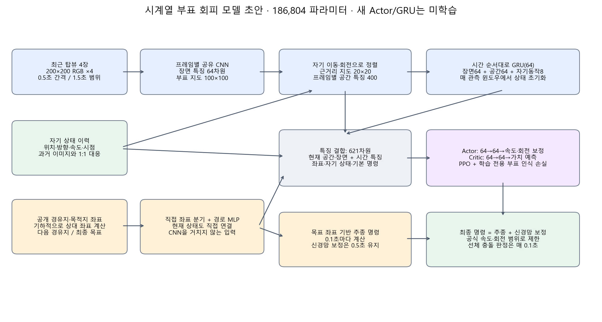
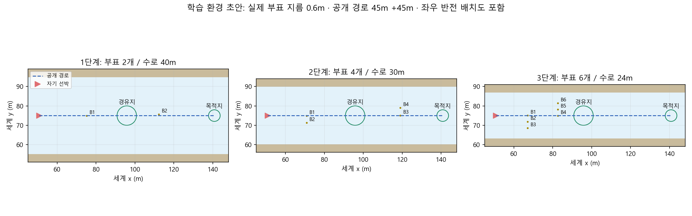

# Temporal top-view buoy navigation

Training source for a shared CNN, ego-motion alignment, 64-unit GRU,
direct waypoint/goal input and residual PPO control. Four 200×200 RGB frames
span 1.5 seconds. Static buoy curriculum: 2 / 4 / 6 buoys, 40 / 30 / 24 m channels.

[Open the GPU notebook in Colab](https://colab.research.google.com/github/seungjoolee24/usvnav-temporal-buoy/blob/main/training/notebooks/train_temporal_buoy_colab.ipynb)

Open the public GitHub notebook in Colab and sign in to your Google account.
No GitHub token is needed. Select a GPU runtime, run the setup cells, review the examples and set
`CONFIRM_ENVIRONMENT=True` before the first 4,096-decision stage-1 experiment.

Checkpoints and logs are copied every 30 seconds to
`MyDrive/usvnav-temporal-buoy-ppo/`. Resume from a temporal-policy
`latest-policy.zip` or `final-policy.zip`. Stage promotion is manual and should
follow validation success, collision and hull-clearance checks.

This repository includes simulator source, training code and reviewed course
settings. Local environments, collected data, existing checkpoints and credentials
are excluded. No newly trained policy is claimed by this initial export.

[Korean setup instructions](training/cloud_training.md) ·
[Model and course review](training/courses/temporal-buoy-v1/review.md)

