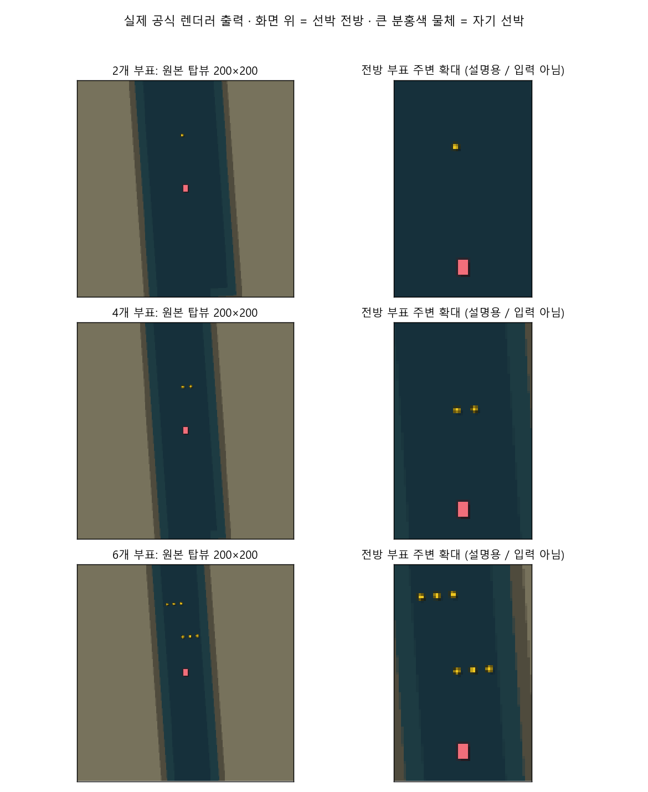
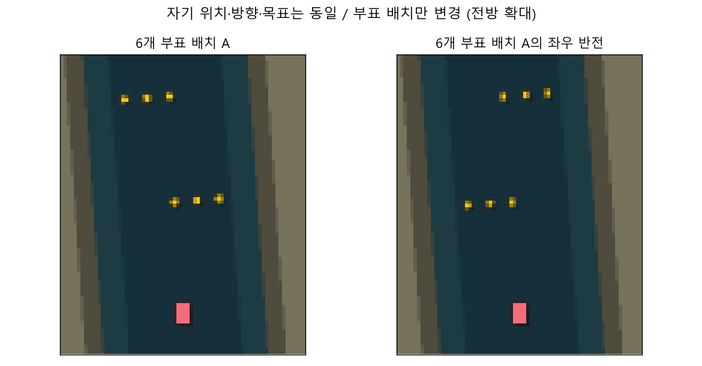
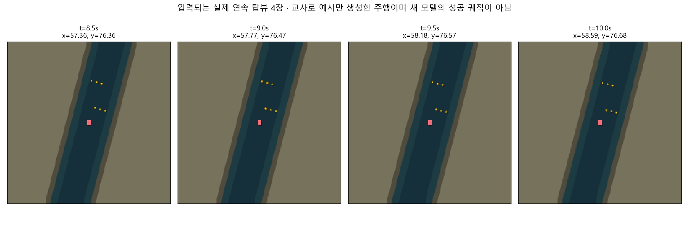

# 시계열 다중 부표 모델 및 학습 환경 초안

2026-10-02. 상태: **사용자 환경 확인 대기 / 새 모델 학습 미실행**.

## 모델

최근 200×200 RGB 탑뷰 4장(0.5초 간격, 1.5초 이력)을 동일 CNN으로 처리한다.
공개 자기 위치·방향으로 과거 부표 확률 지도를 현재 좌표계에 정렬한다.
장면 특징·근거리 부표 공간 특징·자기 동작을 GRU 64차원으로 시간 순서대로
결합한다. GRU 상태는 매 관측 윈도우에서 초기화된다.
경유지·최종 목표와 자기 상태는 별도 직접 입력 분기를 통해 정책에 연결된다.
최종 명령은 목표 좌표로 계산한 기본 추종 명령과 신경망 보정의 합이다.
621차원 특징, 정책 전체 186,804개 파라미터. CPU 단일 관측 추론 중앙값 약 30ms.

## 환경

| 단계 | 부표 수 | 수로 폭 | 배치 목적 |
|---|---:|---:|---|
| 1 | 2개 | 40m | 두 경로 구간에서 각각 회피 |
| 2 | 4개 | 30m | 경로 위 부표와 우회 방향의 부표를 함께 회피 |
| 3 | 6개 | 24m | 서로 반대 방향으로 놓인 3개씩 두 묶음 연속 회피 |

출발→경유지→목적지의 두 구간은 각각 약 45m다. 시작 방향 ±8°, 경로 꺾임 ±5°,
부표 위치 변동과 좌우 반전 배치를 포함한다. 부표 지름 0.6m, 선체 3×2m,
원래 물리 적분·선체 충돌 판정 0.1초, 정책 결정 간격 0.5초, 제한 180초.
이번 대상은 정적 부표이며 이동 선박·외란은 포함하지 않는다.

탑뷰는 실제 공식 렌더러 출력이다. 왼쪽은 모델이 받는 원본이고 오른쪽은 설명용
확대다. 100×100m 시야 밖의 부표는 초기 이미지에 보이지 않을 수 있다.
같은 공개 경로에서 부표만 좌우 반전한 검증 사례를 포함해 경로 암기를 검사한다.

위 연속 이미지는 기하적 교사로 실제 시뮬레이터를 조종해 만든 입력 예시다.
새 신경망의 성공 주행을 의미하지 않는다. 교사는 실제 추론 입력에 사용하지 않는다.

## 학습안과 검증

코스 풀은 학습 60·검증 30·최종 시험 60·사용자 검토 6개다.
코스 hash와 생성 seed를 분리하고 검토·최종 시험 코스는 학습에 사용하지 않는다.
1단계는 빈 코스 20%+2개 부표 80%, 2단계는 빈 20%+2개 25%+4개 55%,
3단계는 빈 20%+2개 15%+4개 20%+6개 45%를 제안한다.
PPO와 시뮬레이터 정답을 이용한 부표 인식 보조 손실을 함께 사용한다.
정답 객체 위치는 학습 손실·보상·교사 검증에만 사용하며 정책 관측에 넣지 않는다.
단계별 별도 검증 10개 중 9개 이상 완주, 선체 여유 거리 0.8m 이상,
이전 단계 성능 유지와 영상 의존성 검사를 승급 기준으로 제안한다.
실제 학습 성과를 보고 기준과 학습량을 조정한다.

156개 코스가 공식 구조 검사를 통과했다. 대표 검토 배치 6개는 기하적 교사의
실제 물리 주행으로 모두 완주했으며 최소 선체 여유 거리는 1.75~1.99m다.
이는 예시 환경이 주행 가능하다는 확인이며 새 정책의 회피 성능이 아니다.
시간 순서 반영, 과거 프레임 기울기, 자기 이동 정렬, 직접 목표 입력,
중복 초기 프레임 처리, 저장·재로드 일치를 확인했다.

코드: `training/temporal_buoy_policy.py`, `training/temporal_buoy_curriculum.py`,
`training/train_buoy_navigation.py`. 상세 수치는 `review.json`, 코스 풀은
`courses/manifest.json`, 미학습 체크포인트는 `untrained-temporal-policy.zip`.
환경 manifest의 승인 상태는 `pending_user_confirmation`이다.
